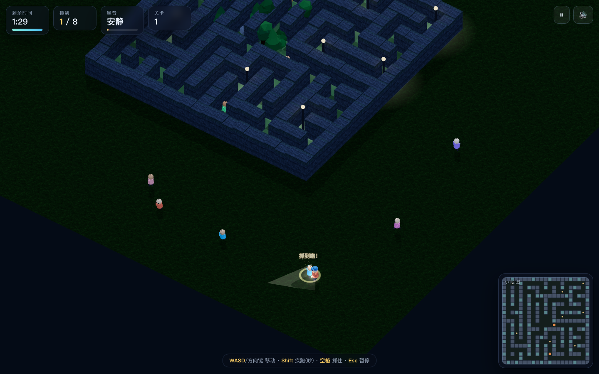

# 疯狂捉迷藏 · 3D Hide &amp; Seek

一个基于 **three.js** 的网页 3D 捉迷藏小游戏：**固定视角、斜俯瞰（等距）镜头**，你扮演拿着手电筒的捉人者，
在天黑之前把躲在公园里的小捣蛋鬼全部揪出来。

**🎮 在线试玩：<https://hydrogx.github.io/crazy-hide-and-seek/>**



---

## 快速开始

| 方式 | 操作 |
| --- | --- |
| **在线玩** | 打开 <https://hydrogx.github.io/crazy-hide-and-seek/> |
| **下载即玩** | 下载仓库里的 `docs/index.html`（单文件、内联 three.js），双击就能离线玩 |
| 本地开发 | `python3 -m http.server 8781` 后打开 `http://127.0.0.1:8781/index.html`（改源码即时生效） |

> 仓库里的 `docs/index.html`、`疯狂捉迷藏.html` 都是**自动生成的单文件产物**，请勿直接编辑。
> 改完 `index.html` / `js/` / `css/` 后运行 `node tools/build-standalone.mjs` 重新生成。

## 部署

站点是**纯静态**的：没有任何构建步骤、没有运行时依赖、没有外部 CDN 请求。部署目录就是 **`docs/`**。

### GitHub Pages（已配置好，推送即自动部署）

- 工作流 [`.github/workflows/pages.yml`](.github/workflows/pages.yml)：push 到 `main` 后自动重新打包并发布 `docs/`。
- 仓库 **Settings → Pages → Source** 需要选 **GitHub Actions**（一次性设置）。
- 也可以完全不使用工作流：把 Source 选成 **Deploy from a branch → `main` / `docs`**，同样能直接跑。
- 线上地址：<https://hydrogx.github.io/crazy-hide-and-seek/>

### Cloudflare Pages

任选一种：

```bash
# A. 用 Wrangler 直接部署（wrangler.jsonc 已指向 docs/）
npx wrangler pages deploy

# B. 用 Git 集成：在 Cloudflare Dashboard → Workers & Pages → Create → Pages 连接本仓库
#    Framework preset : None
#    Build command    : （留空）
#    Build output dir : docs
```

`docs/_headers` 已经配好缓存与安全响应头（Cloudflare Pages 自动识别；GitHub Pages 会忽略该文件）。

### 其他静态托管（Netlify / Vercel / 对象存储 / Nginx）

把 `docs/` 目录整体上传即可，入口文件是 `docs/index.html`。

## 操作

| 操作 | 键位 |
| --- | --- |
| 移动 | `WASD` / 方向键，或**鼠标左键点地面**自动走过去 |
| 疾跑（噪音大，会把躲藏者吓跑） | 按住 `Shift` |
| 抓住 | 靠近后**按住 `空格`**（或按住鼠标右键）直到进度环充满 |
| 暂停 / 音效 / 重开 | `Esc` / `M` / `R` |
| 手机 | 左下虚拟摇杆 + 右下「抓住」按钮 |

## 玩法规则

1. 每局随机生成一座 21×21 的夜间公园迷宫，**所有躲藏者都会先跑开再躲起来**。
2. 躲藏者会躲在灌木、石头、木箱后面（蜷缩起来），并会**定期偷偷换位置**。
3. 他们能听见动静：**疾跑会惊动更远的范围**，被惊动后会狂奔逃跑；被紧追会体力下降、渐渐变慢。
4. 靠近到 1.65 米内、按住空格读满 1.05 秒即可抓住，抓住时会有星星和音效反馈。
5. 三个难度：轻松 6 人 / 120 秒、普通 8 人 / 90 秒、疯狂 11 人 / 75 秒；通关后可选「下一关」，关卡越高人越多、时间越少。

## 技术要点

- **固定斜俯瞰视角**：`THREE.OrthographicCamera` 沿固定方向 `(0.6, 1.05, 0.85)` 观察，镜头只做轻微跟随推镜（跟随系数 0.62），保证整张地图始终可读。
- **等距投影对齐**：镜头方向经过挑选，使迷宫内部对角线与屏幕竖直线重合（±45°），路径走向清晰、不会交错。
- **纯程序化资源**：地形/石墙/树皮贴图用 `CanvasTexture` 现场绘制；音效全部用 WebAudio 合成（脚步、偷笑、抓住、胜负音），无任何外部素材。
- **性能**：墙体用 `InstancedMesh`；树/灌木/石头/木箱用自研几何合批（`batch()` 按材质合并 `BufferGeometry`）把 draw call 从 500+ 压到 150~200。
- **AI 状态机**：`idle → toSpot → hiding → flee → found`，配合 8 方向避障评估、被追赶耗尽体力、丢失目标后重新选点躲藏。
- **零依赖**：仓库内自带 `vendor/three.min.js`（r160），不依赖 CDN，离线可玩。

## 目录结构

```
docs/                       ★ 部署目录（GitHub Pages / Cloudflare Pages 指向这里）
  index.html                  单文件版游戏（自动生成，内联 three.js）
  preview.png                 README 预览图
  .nojekyll                   关闭 GitHub Pages 的 Jekyll 处理
  _headers                    Cloudflare Pages 响应头
index.html                  开发入口（引用下面的 js/css/vendor）
css/style.css               UI 样式
js/core/util.js             配置常量、可复现随机数、数学工具
js/core/audio.js            WebAudio 程序化音效
js/core/input.js            键鼠 + 触屏摇杆输入
js/game/maze.js             迷宫生成（DFS + 拆死胡同 + 中心广场）
js/game/scene.js            场景构建：天空/雾/灯光/贴图/合批/躲藏点/路灯
js/game/characters.js       角色模型与走路 / 躲藏 / 被抓动画
js/game/particles.js        粒子、光环、飘字
js/game/minimap.js          小地图（动静提示）
js/game/game.js             主循环、碰撞、抓取、AI、相机、HUD
js/main.js                  启动流程与 UI 事件
tools/build-standalone.mjs  打包单文件 HTML（--dev 生成根目录双击版，--check 供 CI 校验）
tools/check.mjs             无头浏览器自检（截图 + 控制台错误 + 状态断言）
tools/push-to-github.sh     一键建库并推送
wrangler.jsonc              Cloudflare Pages 配置（输出目录 = docs）
vendor/three.min.js         three.js r160（本地内置）
.github/workflows/pages.yml GitHub Pages 自动部署
```

## 自检

```bash
python3 -m http.server 8781          # 另开一个终端
node tools/check.mjs --shots         # 菜单 / 开局 / 抓人 / 结算 / 稳定性 五项检查
```

自检会输出每步的游戏状态、控制台错误、draw call 与实测帧率，并把截图写到 `/tmp/hs_*.png`。
